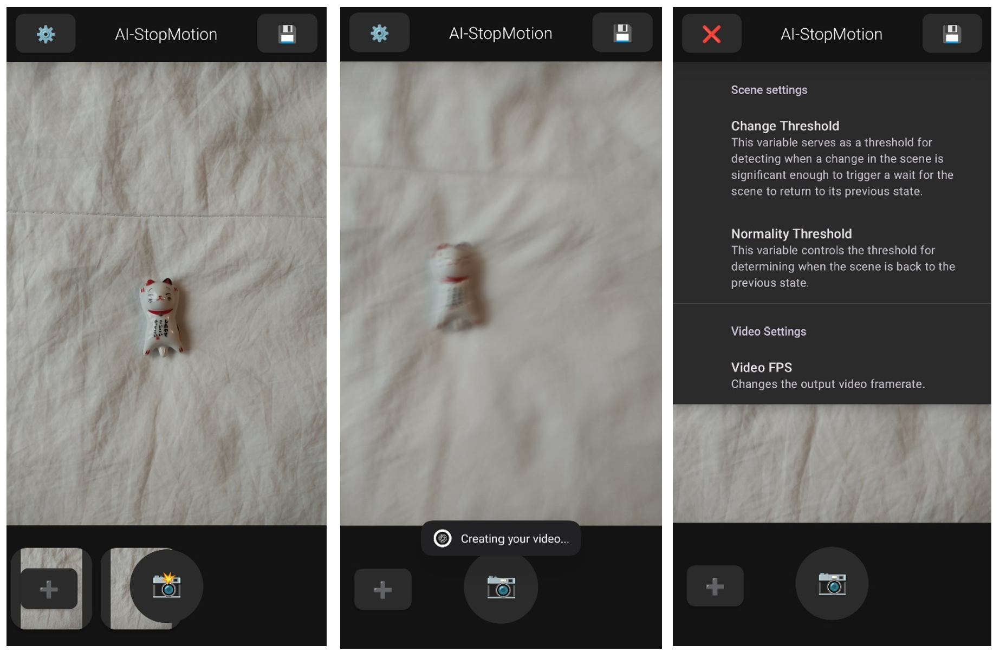
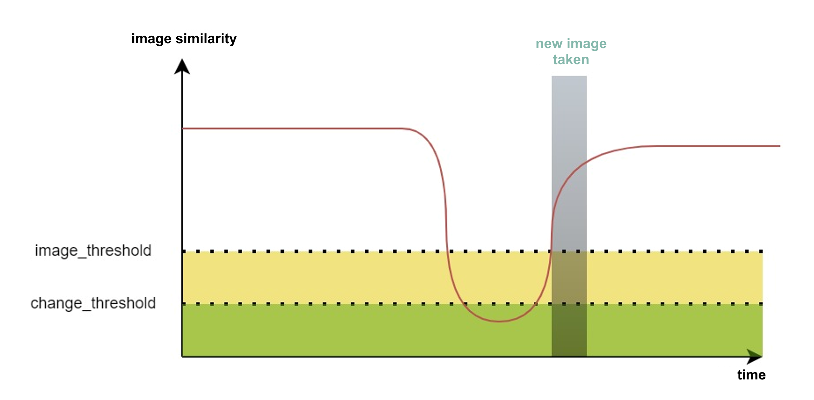
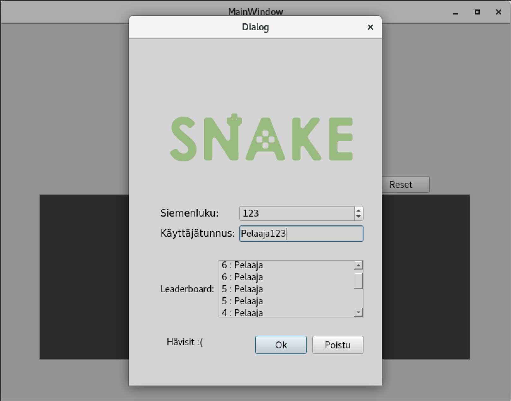
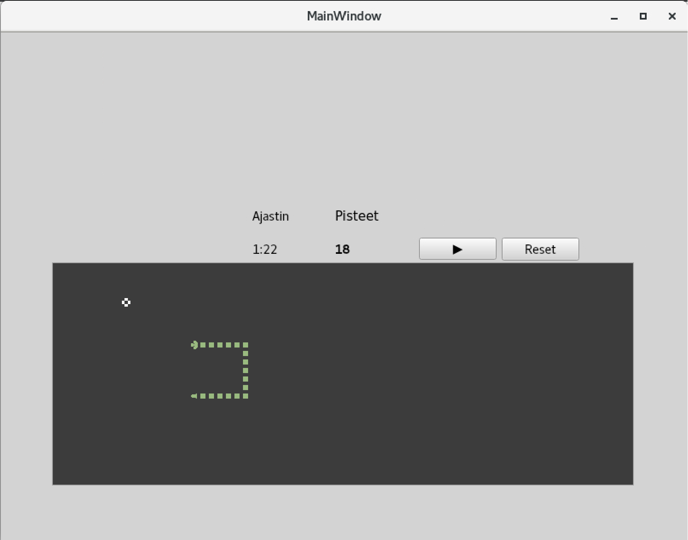
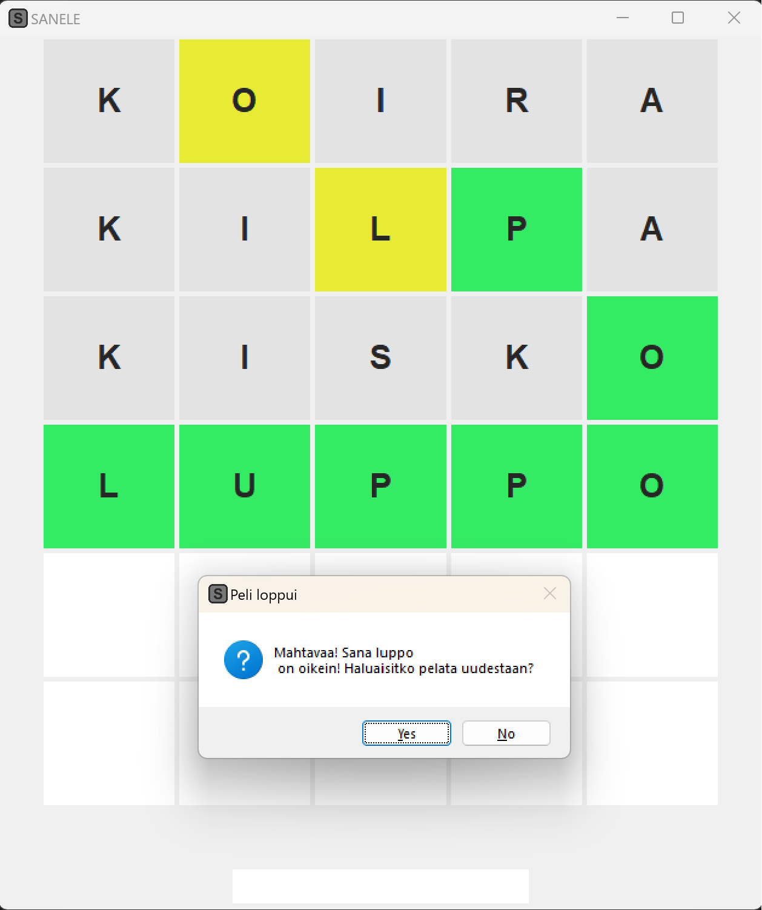
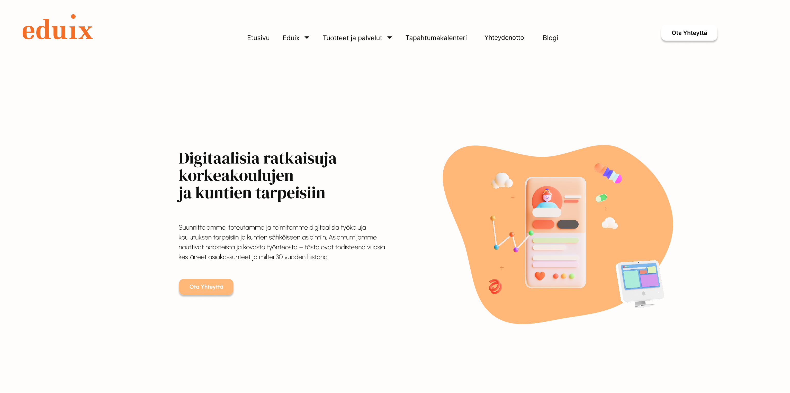
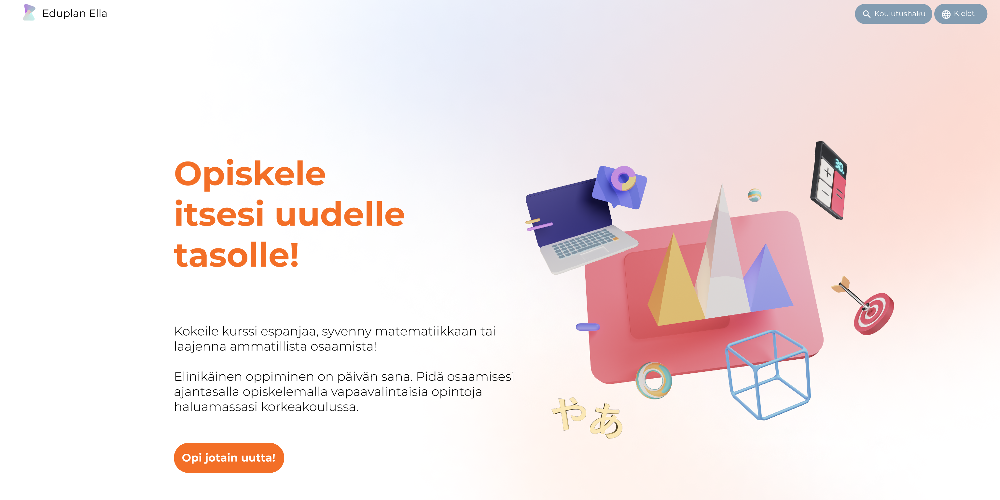
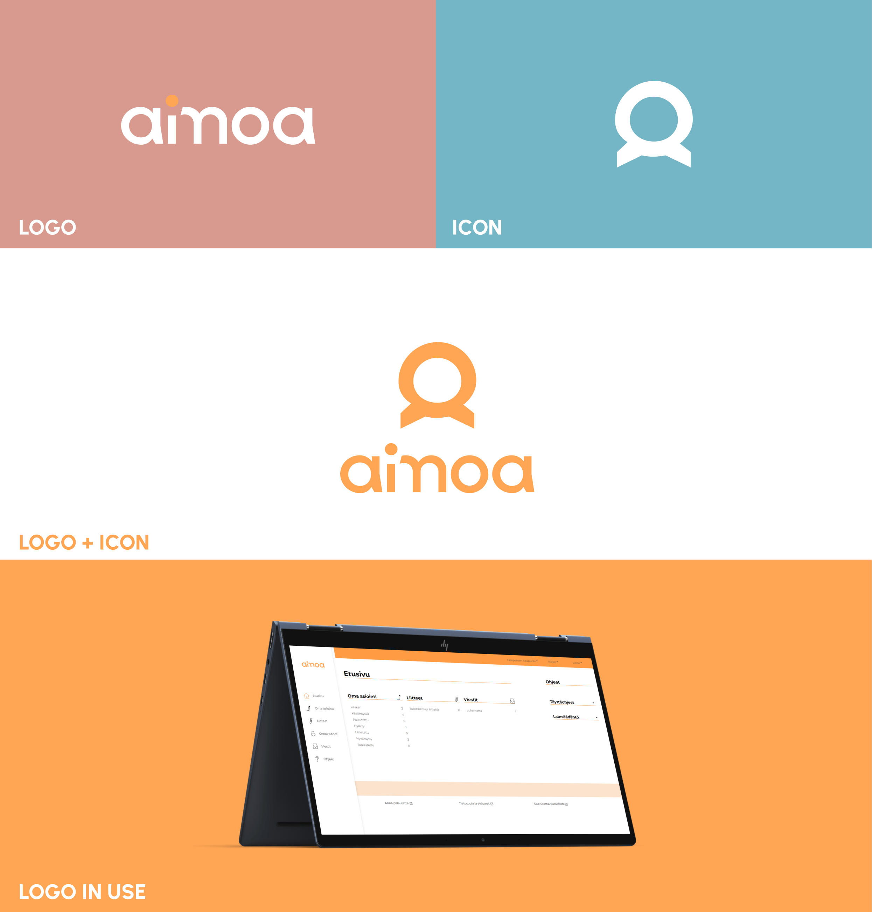

# Programming Projects

### AI-imaging app (Kotlin)

As a larger project for my mobile developement course, I implemented *Ai-StopMotion*, an automated stop motion camera application.

The idea for the project came about by chance while watching an animated video someone put together: could that be done smarter, in the spirit of the times, with the help of "artificial intelligence"? When after some light research I couldn't find a similar implementation, I decided to make one myself. And even if the end result does not use neural networks, it is perhaps still a little bit "intelligent".

I approached the project in parts, because I knew I needed at least three broader functionalities: a way to distinguish changes in the image, a way to take pictures at a given interval, and a way to compose a video from the pictures taken. The differences between the images were relatively easy to compute using a suitable library. OpenCV proved to be the best choice from the start and I was able to relatively easily create a test application that reported the percentage of coherence between two images. Interval scanning was also a relatively straightforward implementation, although it required a little more familiarisation with the Android world. The handling of intermediate files and saving them to a gallery required a bit of experimentation. Compiling the images into a video was by far the most difficult of the three sections. I tried at least two different methods before settling on FFmpeg, which took another handful of hours to implement in a meaningful way.

The implementation of these three parts then took some time. In addition to these three functions, I added a settings window, a sound effect to tell you when an image is saved and a feature to import images from the gallery.  Each improvement brought a few new problems and a handful of ideas for improvements.

The working principle of the application is roughly as follows: When the user clicks on the camera button, the application takes a reference image. The application then compares the images taken at a set interval with this reference image until the similarity of something falls below a set threshold (change_threshold). This change reflects a more radical alteration of the view, for example when a hand moves a character to be animated.  When the view finally changes closer to the reference image, i.e. when the similarity exceeds the image_threshold, a new image is saved as the reference image and in the gallery, and a recyclerView is added. This step represents the removal of the hands from the slightly modified view. Finally, the user can export their image to video.

### Snake Game with Graphical User Interface (Qt, C++)

This project aimed to enhance a snake game originally implemented with ASCII prints by adding a graphical user interface (GUI) using the Qt framework. The goal was to separate the user interface from the game's action logic, practicing modularity and implementing a timer for automatic snake movement. Backend logic is based on `Point` and `GameBoard` classes in the Qt project. User interface functionalities are implemented in the `MainWindow` class. 

**Features:**

- Snake grows when it eats, making the food disappear and reappear in a new location.
- Seed value input.
- Adjustable gameboard size (width and height).
- Visual representation of the snake and food using graphical components.
- Distinguishable features for the snake's head, tail, middle, and food.
- Game status indication for win/loss.
- Option to restart the game.
- Leaderboard.
- Option to pause/continue.
- Simple timer.

### SANELE - A Wordle Clone (Python)

SANELE is a Finnish-language clone of the popular game WORDLE. While the idea itself is not groundbreaking, the implementation turned out to be quite enjoyable. The game incorporates all features found in WORDLE, including letter coloring (more on that later!).

**Game Mechanics Overview:**
The goal of the game, similar to its inspiration, is to correctly guess a randomly selected five-letter word. All guesses must be valid Finnish words. Press the ENTER key to submit your guess. After each guess, the colors of the tiles indicate how close you are:

- Red: Correct letter in the correct position
- Yellow: Correct letter in the wrong position
- Gray: Incorrect letter

**Game Functionality:**
`Sanakirja1.txt` contains relatively common words to be guessed, while `Sanakirja.txt` includes all possible valid guesses. The script uses the vocabulary XML file from [https://joukahainen.puimula.org/](https://joukahainen.puimula.org/) as a source.

Workflow:
1. `self.word_picker` selects a random word from `Sanakirja1.txt`.
2. The user tries to guess the word using the `self.__input` Entry widget.
3. `self.checker` verifies the input and creates a string indicating the colors of the letters.
4. `self.letter_colorer` displays and colors the letters on the screen using a for loop.

# UI/UX-Design

### A Proposal for Eduix-homepage

[Eduix Proposal](https://www.figma.com/proto/7LydI98gJ1AUnK4i55s4T8/Eduix_demo--nettisivuideoita?node-id=1-2&starting-point-node-id=1%3A2&scaling=scale-down-width)

In my recent role at Eduix, I crafted this UI prototype with Figma, showcasing a vibrant color scheme that centers around a revitalized orange hue. The contemporary and vibrant color palette is enhanced by modern 3D icons, creating an airy and spacious visual experience. I employed Urbanist as the primary font and DM Display Serif for headings, achieving a contemporary yet distinctive grounded visual aesthetic.(1)

### A Proposal for Eduplan Ella

[Eduplan Ella Proposal](https://www.figma.com/proto/ZqpwgdtrQrM1IaR7glljaH/Eduplan-Ella--nettisivuideoita?node-id=1-2&scaling=scale-down-width)

This smaller demo, crafted at Eduix, reimagines the contemporary aesthetic of Eduplan Ella. A vibrant gradient background fosters a modern ambiance, complemented by lively 3D-icons.(1)

# Logo Design

### Aimoa

I designed a visual identity for Aimoa, an electronic administration service targeted at the needs of municipalities, welfare regions, county associations and parish associations. The logo comprises an icon featuring a user and the letter A, accompanied by a stylized and distinctive text-based design.(1)

(1). Logos and materials are the intellectual property of Eduix.